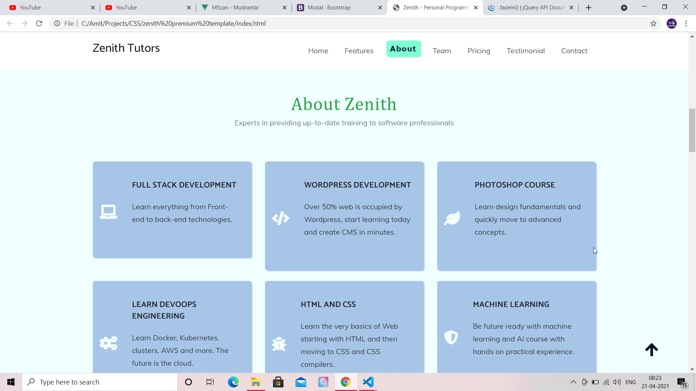

# A Single Page HTML5 and CSS3 theme created in Bootstrap 4.
 
A single page theme based on fictional company called "Zenith" which runs online tutor business and has course in different
domains of Computer Science. 
## Getting Started

* Simply download or clone project files and open index file in your browser.

## Features

* Single Page Theme
* Contains Scroll Spy navigation.
* Carousel Slider using Owl Carousel Library.
* Animated sections using AOS library.
* Lightbox using Magnific Pop Up library.
* Fully Responsive. 

## Built With

* [Bootstrap 4](https://reactjs.org/)
* [Jquery](https://material-ui.com/)
* [Owl Carousel](https://owlcarousel2.github.io/OwlCarousel2/docs/started-welcome.html)
* [AOS - Animate On Scroll](https://michalsnik.github.io/aos/)
* [HTML + CSS + SCSS](https://www.w3schools.com/html/html_css.asp)

## Authors

* **Amit Prafulla (APFirebolt)** - (http://amitprafull.com/)

## License

This project is licensed under the MIT License - see the [LICENSE.md](LICENSE.md) file for details

## Screenshots

Please find some of the screenshots of the application. Below is the screenshot of the homepage of the theme.

This is one section of this one page theme.

